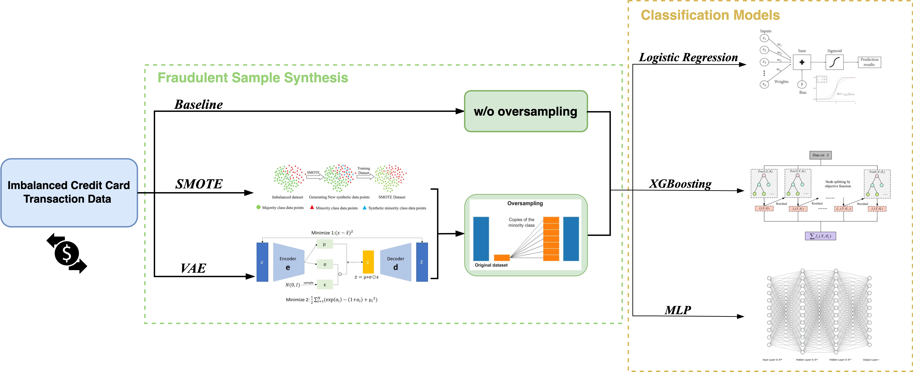

# Enhanced Credit Card Fraud Detection with Deep Generative Models

This is the code repository for the project *Enhancing Credit Card Fraud Detection through Oversampling: A Comparative Analysis of SMOTE and VAE* [slide](./assets/slides_fraud_detection.pdf), which explores the improvement of fraud detection accuracy using two oversampling techniques: **Synthetic Minority Over-sampling Technique (SMOTE)** and **Variational Autoencoders (VAE)**., which explores the improvement of fraud detection accuracy using two oversampling techniques: **SMOTE** and **Variational Autoencoders (VAE)**.

- Our project focuses on detecting fraudulent transactions from highly imbalanced credit card datasets, where fraudulent transactions constitute only 0.17% of the data.
- By comparing SMOTE and VAE, we aimed to enhance the accuracy of several machine learning models in fraud detection, including **Logistic Regression**, **XGBoost**, and **Multi-Layer Perceptron (MLP)**.
- VAE demonstrated superior performance across all models, particularly in combination with **XGBoost**, achieving the highest AUPRC scores.

---

## Method

We use the following over-sampling techniques to handle dataset imbalance:
- **SMOTE**: A commonly used technique that generates synthetic samples by interpolating between existing minority class samples.
- **VAE**: A deep learning model that generates synthetic minority samples by modeling the data distribution, producing more realistic and diverse samples.

After data being over-sampled, we train different ML classifiers benefited and augmented by the above techniques:
- **Logistic Regression**: A linear model effective for binary classification tasks.
- **XGBoost**: A powerful ensemble model capable of handling complex patterns in tabular data.
- **MLP**: A neural network that excels at capturing non-linear relationships in data.

See the following overview of pipeline for improved credit card fraud detection:

---

## Dataset

The dataset used for this project was sourced from Kaggle: [Credit Card Fraud Detection Dataset](https://www.kaggle.com/datasets/mlg-ulb/creditcardfraud).

- The dataset contains transactions made by credit cards in September 2013 by European cardholders. It presents transactions that occurred over two days, with 492 frauds out of a total of 284,807 transactions. 
- The dataset is highly imbalanced, with the positive class (fraudulent transactions) accounting for only 0.172% of all transactions.
- It contains only numerical input variables due to confidentiality issues. The features V1, V2, ..., V28 are the principal components obtained using PCA. The only features that have not been transformed by PCA are:
  - **Time**: Represents the seconds elapsed between each transaction and the first transaction in the dataset.
  - **Amount**: Represents the transaction amount and can be used for example-dependent cost-sensitive learning.
  - **Class**: The response variable, which takes the value of 1 in case of fraud and 0 otherwise.

For privacy reasons, more detailed background information about the data cannot be provided.

## Evaluation Results

All models were evaluated using `Area Under the Precision-Recall Curve (AUPRC)`, a metric particularly useful for imbalanced datasets.

| Model                  | Logistic Regression | XGBoost  | MLP      |
|------------------------|---------------------|----------|----------|
| **w/o over-sampling (baseline)**| 0.6543              | 0.7714   | 0.6798   |
| **baseline w/ SMOTE**          | 0.7452              | 0.8129   | 0.7685   |
| **baseline w/ VAE**            | 0.8046              | **0.8932**   | 0.8347   |

---

## Conclusion

- **VAE** consistently outperformed **SMOTE**, providing superior synthetic data and enhancing model performance.
- **XGBoost** was the most effective model, achieving the best results with VAE.
- These findings have real-world implications for the financial industry, where accurate fraud detection is critical in reducing security risks and improving the reliability of financial transactions.

---

